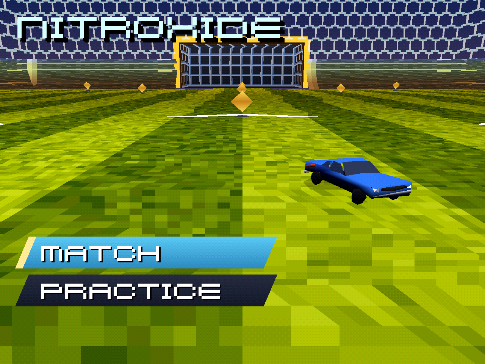
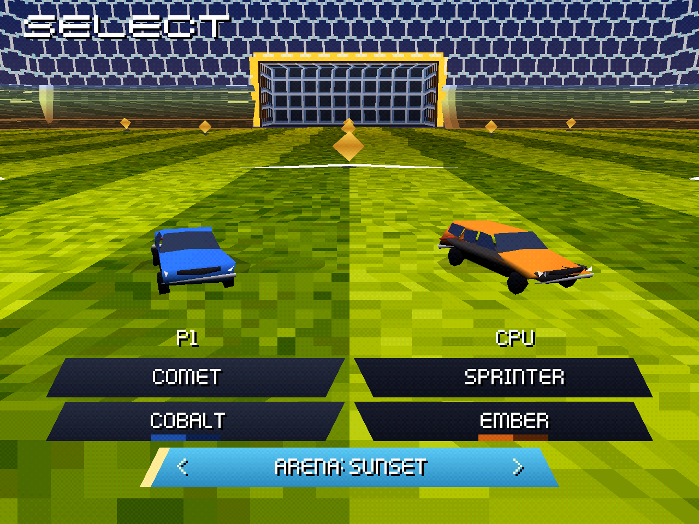
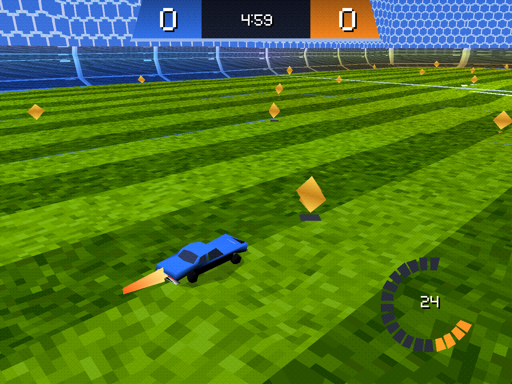
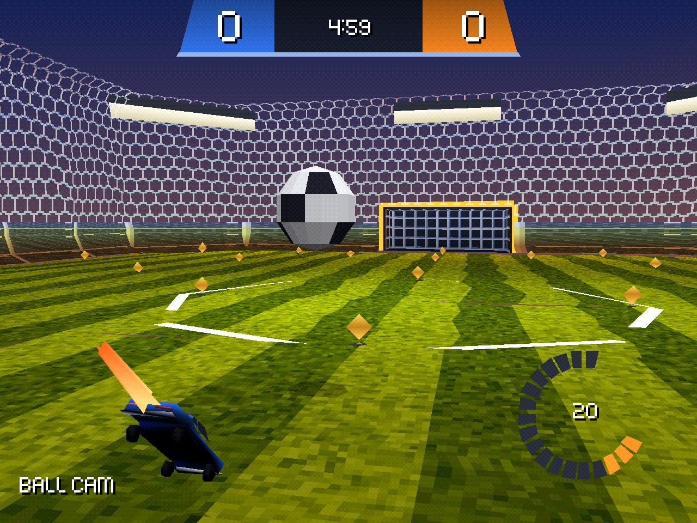
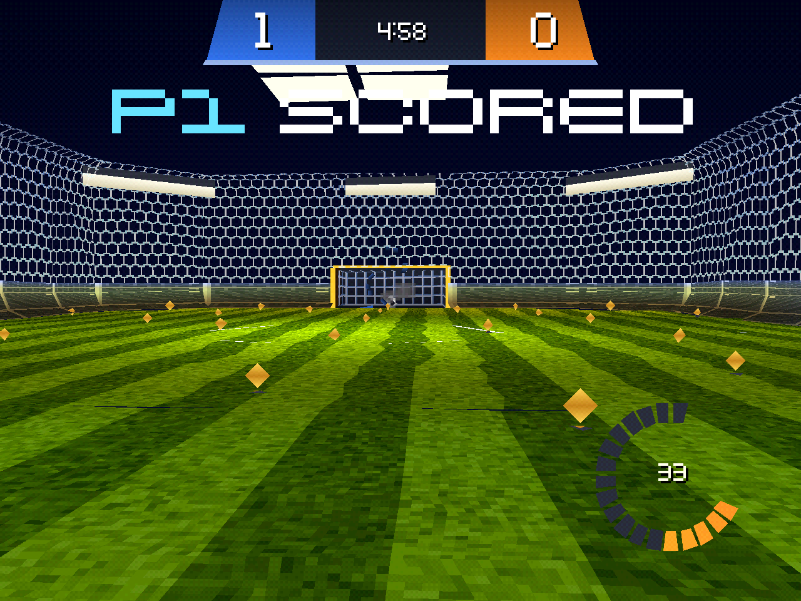
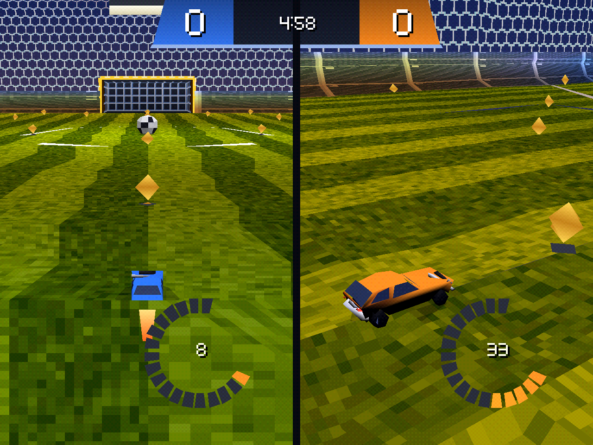

# NitroXide

Rocket-powered car soccer for the original PlayStation, written in Rust on the
[PSoXide](https://github.com/EBonura/PSoXide) SDK and engine. Drive a car into a
ball, put the ball in the net, burn nitro to get there first.

No emulation, no reverse-engineered assets: this is an original game that
borrows the shape of the genre. It runs on real hardware. GPL-2.0-or-later,
matching PSoXide.

## Screenshots

Captured at 1280×960 through PSoXide's hardware renderer. The game itself
runs at the original PlayStation's 320×240 resolution.

| **Sunset title screen** | **Match setup and arena selection** |
| :---: | :---: |
| [](readme-assets/menu-title-sunset.png) | [](readme-assets/menu-select-sunset.png) |
| **Daylight boost run** | **Sunset aerial** |
| [](readme-assets/gameplay-day-boost.png) | [](readme-assets/gameplay-sunset-aerial.png) |
| **Night goal celebration** | **Two-player split-screen** |
| [](readme-assets/gameplay-night-goal.png) | [](readme-assets/gameplay-sunset-split.png) |

## Play it

The disc image is on [itch.io](https://bonnie-studios.itch.io/nitroxide),
music included: the soundtrack rides the disc as CD audio, so the download is
the full experience. NitroXide also ships on the
[PSoXide Demo Disc](https://bonnie-studios.itch.io/psoxide-demo-disc) with
nine other programs, and that disc runs
[in your browser](https://bonnie-studios.itch.io/psoxide) on the PSoXide
page, no console needed.

## Build

```sh
make bootstrap   # fetch the pinned PSoXide submodule
make test        # physics tests, on the host, no console needed
make build       # PSX-EXE at game/target/mipsel-sony-psx/release/nitroxide.exe
make disc        # bootable disc, straight into the PS1 library
make run         # disc + boot it in the PSoXide frontend
```

Discs always land in `~/Downloads/ps1 games/NitroXide/`, never in a folder
inside the repo. That is where the emulator's library and the burn tooling both
look, so a finished build is always one that can be launched or burned without
a copy step. Override with `make disc GAMES_DIR=...` or `GAME_NAME=...`.

Nightly Rust, date-pinned in `rust-toolchain.toml` to match the submodule.

## Controls

| Button | Action |
| --- | --- |
| R2 | accelerate |
| L2 | reverse / brake |
| X | jump / select |
| Circle | boost |
| Triangle | toggle ball cam |
| L1 | powerslide / air roll |
| D-pad or left stick | steer |
| Start | begin / restart |

## Layout

```
sim/                 integer physics: ball, car, arena, goals, scoring. no_std, host-tested.
game/                the PS1 binary: pad in, sim tick, GTE render, HUD.
game/assets/*.psxm   cooked car meshes, committed.
game/assets/disc/    cooked startup assets packed into WORLD.PAK.
assets-src/          editable texture sources, committed.
tools/cook-arena/    host tool: source imagery + patterns -> shared .psxt.
tools/cook-models/   host tool: glTF -> .psxm, via PSoXide's own importer.
```

The split is the point. `sim/` has no PlayStation in it at all, so `make test`
runs the whole match model on the host in milliseconds, and tuning how the
game *feels* never needs a console or an emulator in the loop. `game/` only
draws what the sim already decided.

Everything is i32 fixed point: no floats, no 64-bit math. The PS1 has no FPU,
and 64-bit division is slow enough to matter. Lengths are Rocket League's own
unreal units, stored in sub-units (`1 uu = 64 sub`), angles are Q0.12 (`4096` =
one turn, the GTE's own convention), and one tick is one 60 Hz frame.

The renderer runs everything through one transform: the camera builds a view
matrix, and each object loads `view * rotation` into the GTE with
`view * (object - camera)` as the translation.

The arena and the ball are procedural quads built here. The car is a cooked
mesh drawn through PSoXide's own `GouraudRenderPass`, which handles projection,
back-face culling, per-vertex GTE lighting and OT insertion. Rewriting that
badly was the alternative.

The arena's shape is one cross-section swept around the perimeter: floor edge,
a quarter turn up into the wall, the wall, a quarter turn over into the
ceiling. Sweeping one profile is what gives the side walls, the corner chamfers
and the end walls a consistent silhouette, and it is the difference between a
Rocket League arena and a crate.

Floor, walls, the honeycomb enclosure, and the square goal net share one
224x132 4bpp atlas. It is cooked to PSoXide's common `.psxt` format on the
host, packed as chunk 1 in `WORLD.PAK`, loaded synchronously at startup, and
discarded from RAM after upload to VRAM. Three CLUT rows give the grass, wall,
and translucent meshes independent palettes while sharing one texture page.
The team-end warmth remains a per-quad tint rather than a second texture. The
car is not textured; see below.

## Car models

Five low-poly cars, cooked from glTF by `tools/cook-models`:

```sh
make assets      # re-cook from MODELS_DIR, only needed when the sources change
make textures    # re-cook game/assets/disc/chunk_1.psxt
```

Blender first applies every node transform, removes unused UV/color seams,
welds coincident corners, rebuilds the smoothing/hard-edge topology, and uses
quadric-collapse decimation on each object independently. Keeping the objects
separate is essential: global vertex clustering welded nearby wheels, fenders,
lamps, and bodywork into the same centroid and produced the stretched,
inside-out cars from the first cook. Leaving the imported face corners split
was just as bad: wheels received one normal per triangle and adjacent panels
were decimated apart, producing the bright raster cracks from the second cook.

There is one committed LOD: roughly 150 prepared faces per car, because two
cars share the arena's frame budget. There used to be a second 500-face cook
for the front end, back when the menu stood one car on a private plane of grass
with almost nothing else in the frame. The front end draws the real arena now,
and an arena plus a 500-face car does not fit two vblanks, so the detailed cook
is gone along with the showroom that justified it. The cook replaces
collapse-prone wheel shells before decimation with six-sided cylinders, and
carries a four-corner wheel map: tyre, rim, and hub vertices keep shared pivots
after the source nodes are merged into PSXM, letting the front pair steer and
all four wheels spin and move on the visual suspension.

There is one cook per car, not one per team. `paint.rs` gives the two team
variants identical geometry and identical colours everywhere except
`Role::Body` and `Role::BodyDark`, and those are exactly the two the select
screen repaints, so the second cook was a copy carrying the bytes that get
overwritten. Both cars on the pitch are now repainted from the one blob.

PSoXide's `psxed-gltf` imports each prepared GLB and bakes its material colours
into the PSXM face-colour table. The final cook splits vertices only where two
materials meet. `psx-asset` reads the result at runtime, zero-copy, straight
out of the binary.

The tool on top exists for two things the importer does not do:

* **Placement.** `psxed-gltf` normalises every mesh to its own centroid at unit
  extent. Correct for previewing a model, wrong for a game object that has to
  stand at a known size on a known spot, and scaling it back down through the
  `ActorTransform` would quantise visibly as the car turns. So the cooked
  vertex table is refitted in place: 163 uu for the cars and 180 for the
  trucks, with the origin on the ground between the wheels. That matches the
  widened 164 x 116 x 52 uu gameplay hitbox rather than leaving a full-size
  visual wrapped around the literal narrow Octane box.
* **Colour.** glTF `baseColorFactor` is linear. Written straight to 8 bits, the
  sedan's paint lands at 12/255 and the car renders as a black cutout. The tool
  assigns a display-referred team palette, then gives each material boundary
  distinct runtime vertices. Without that split, welded bodywork claimed the
  colour slots shared by windows and wheels and the whole model rendered as a
  single strange-looking blob.

The select screen offers the three intact passenger-car bodies: Comet, Hatch, and
Sprinter. The two heavy-truck source meshes remain in the asset library for
future rework, but are not selectable: both are exposed commercial chassis
rather than complete rocket-car silhouettes. Each selectable car is one asset.

Both seats pick a car and a colour on the select screen, and the colours cannot
collide: stepping the paint skips whatever the other seat is wearing, so there
is nothing to reject at confirm time. The chosen colour follows its seat onto
the scoreboard block, the goal frame and the goal burst. A second pad answering
on port 2 is what makes a match two-player; there is no versus row to pick.

## Checking a render change without a console

```sh
make shot        # boots into a match, holds accelerate, dumps a frame to /tmp
```

`STEPS`, `PULSES`, and `SHOT` are overridable, e.g.
`make shot STEPS=60000000 SHOT=/tmp/early.ppm`.

## Performance

Physics and input run at 60 Hz; the picture is deliberately paced at a steady
30 fps. Rendering uses PSoXide's queued scene contract, so the CPU prepares the
next ordering table while the GPU rasterises the previous one. Text and other
immediate overlays wait until the submitted list has drained, preventing a HUD
write from serialising the whole CPU and GPU workload.

The title and select screens are the match renderer with a parked camera. They
used to be a second renderer: a private plane of grass with its own floor
tessellation, its own lighting falloff, a CPU-projected foreground lattice to
work around the GTE clamping H/Z at 2.0, a reserved 32-slot ordering-table band
for the car, and a detailed car LOD to fill it. All of that is gone. A staged
car is an ordinary sim car parked on the halfway line with its yaw written every
frame, so the front end gets the arena's floor, walls, lighting and goals for
free and there is one place a car can look wrong instead of two.

On the headless PSoXide cycle profiler, 600-tick steady-state runs measured:

| Scene | Visual frames | Misses | Cycles/frame | 1,127,078-cycle budget left |
| --- | ---: | ---: | ---: | ---: |
| Title screen, one car in the arena | 466/466 | 0 | 462,901 | 58.9% |
| Select screen, both cars in the arena | 456/456 | 0 | 591,918 | 47.5% |
| Gameplay, driving with animated wheels | 299/299 | 0 | 719,528 | 36.2% |

These are low-overhead `profile-frame` builds, which retain frame telemetry but
exclude the per-stage marker cost. Every run reports steady two-vblank cadence.

## Not done yet

* **The car is untextured.** The `.psxm` format has no UV or material table,
  and `psxed-gltf` says so: it parses glTF's texture coordinates and then drops
  them. Textured models need the other cooked format, `.psxmdl`, through
  `convert_rigid_model_path`, which carries per-part materials and UVs and is
  drawn by a different engine pass. That is the next real piece of work here,
  not a tweak. These particular models have no texture images anyway, only
  material colours, so it would mean authoring a texture atlas for them first.
* The floor-to-wall and wall-to-ceiling curves are square joins.

## Where the numbers come from

There is no open-source Rocket League, but there are three projects in its
orbit, and they turned out to be useful for completely different reasons.

**[RocketSim](https://github.com/ZealanL/RocketSim)** (MIT, C++) is a
clean-room reimplementation of RL's game logic on Bullet. It is the only one of
the three that is *accurate*, and it is where every constant in `sim/` came
from: the Octane hitbox (120.507 x 86.6994 x 38.6591 uu) and its wheel offsets
and radii, the 1410 uu/s throttle ceiling against 2300 with boost, the
steer-angle-versus-speed curve that makes an RL car turn at a near-constant
2 rad/s, 650 uu/s² of gravity, 0.6 ball restitution, 33.3 boost per second. Its
*code* is useless here (Bullet rigid bodies, doubles, and it wants collision
meshes dumped from a copy of the game you own) but its numbers are the spec.

**[Retro League GX](https://github.com/mholtkamp/retro-league)** (MIT, C++ on
the author's Octave engine) is the closest prior demake: GameCube, Wii and 3DS.
Two things came out of reading it. The useful one is how it splits the arena
into meshes, `Floor`, `Sides`, `BotCurve`, `TopCurve`, `Ceiling`, `GoalsBot`,
`GoalsTop`, which is the confirmation that an RL arena is not a box and that the
curved transitions are a thing you model explicitly. The other is a warning: it
runs full Bullet physics with mesh collision, which a GameCube can afford and a
33 MHz R3000 with 2 MB cannot. Its own arena is also a much longer, narrower
field than RL's, so its dimensions were not worth copying.

**[rocketleague-godot](https://github.com/lufemas/rocketleague-godot)** is a
sandbox: two scripts, a stock Godot `VehicleBody`, and 109 MB of downloaded
assets. Nothing transferable.

So the arena here is Standard Soccar's real footprint: side walls at ±4096,
back walls at ±5120, ceiling 2044, the four corners cut by 45° planes crossing
the axes at 8064, goal mouths 892.755 either side of centre and 642.775 tall.
The corner chamfers are the shape that makes it read as an arena rather than a
crate, and they are collided against, not just drawn. What is deliberately
*not* copied is RL's solver: this runs closed-form sphere-and-plane collisions,
so restitution and grip are feel-tuned rather than derived, and the floor-wall
and wall-ceiling curves are square joins for now.

The car you drive is an imported low-poly model, and the ball meets an oriented
box around it, 164 x 116 x 52 uu, aligned to the model the renderer draws. It
used to meet a radius-84 sphere around the car's centre while the constants and
this file both described a box, which meant a nose, a flank, a bonnet and a
corner were four views of one radial push. They are four different contacts
now.

The box carries no origin-to-hitbox offset: `Car::p` is a centre at a 28 uu
ride height, and RocketSim's Octane offset assumes its own convention, so
mixing the two would double-count it. Adopting the literal Octane box and its
offset together is a later decision about the whole physics/visual convention,
not a prerequisite for the contact being the right shape.

## Licence

GPL-2.0-or-later, the same as [PSoXide](https://github.com/EBonura/PSoXide),
whose SDK and engine this links against. See [LICENSE](LICENSE) for the text,
which is PSoXide's own copy verbatim.

The car models under `game/assets/` are cooked from a third-party low-poly
asset pack and carry whatever terms that pack came with, independently of the
code licence.
